## 🎯 Sistema Kanban Acadêmico 👉 [Acesse o Sistema ](https://escudero03.github.io/Java-Kanban-Projeto/) 👈

  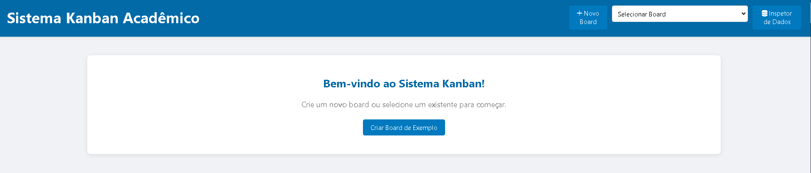

  
---

## Um sistema completo de gerenciamento de boards Kanban com implementação em Java e interface web interativa.

📌 Sobre o Projeto

Projeto que implementa um sistema de gerenciamento no estilo Kanban, permitindo criar e gerenciar boards com colunas e cards, seguindo regras específicas para o fluxo de trabalho.
---

## 🖼️ Galeria de Imagens

  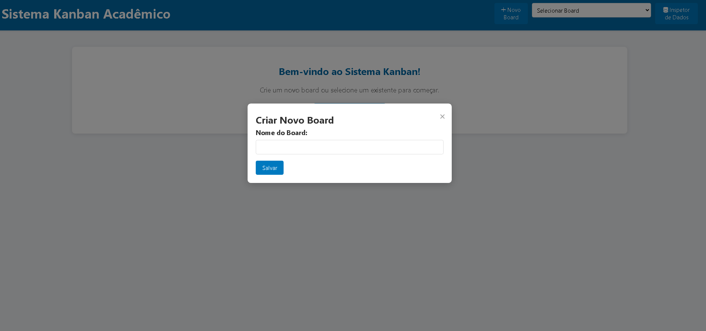
  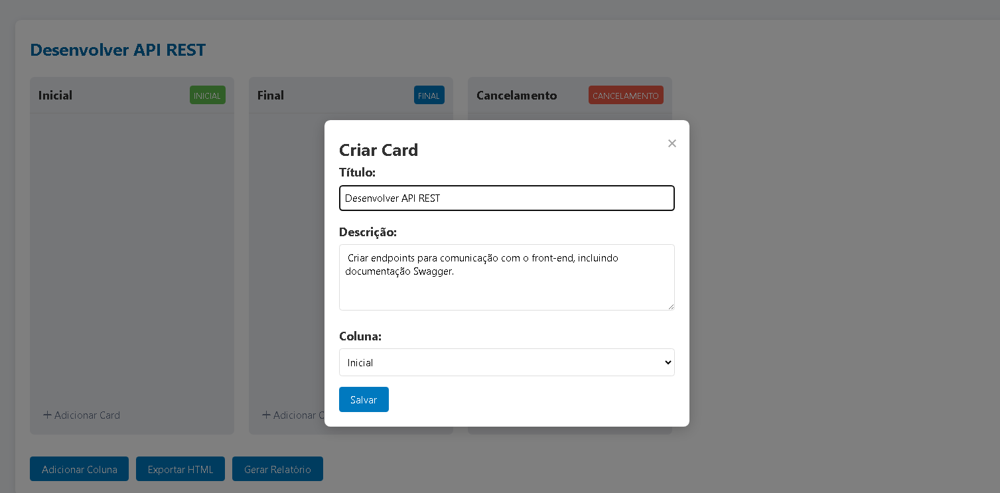
   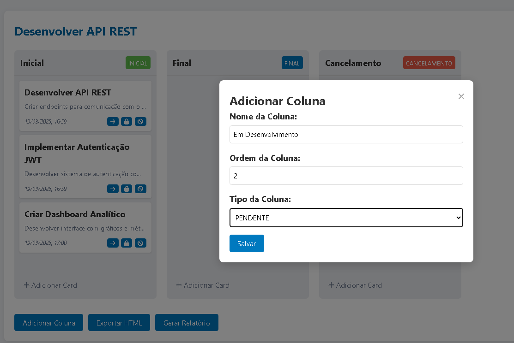
  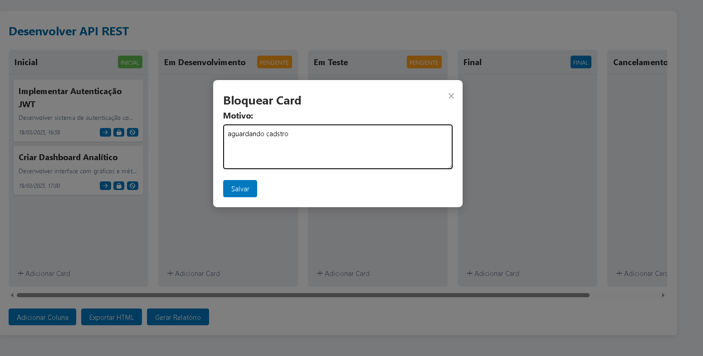
  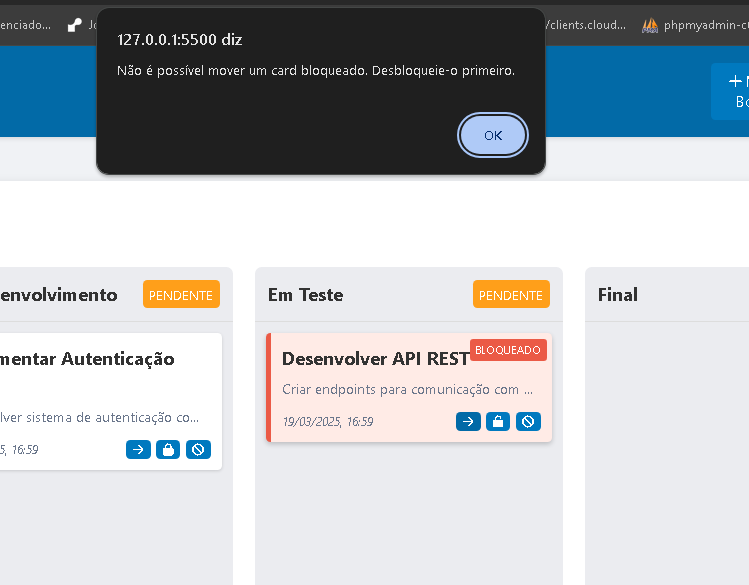
   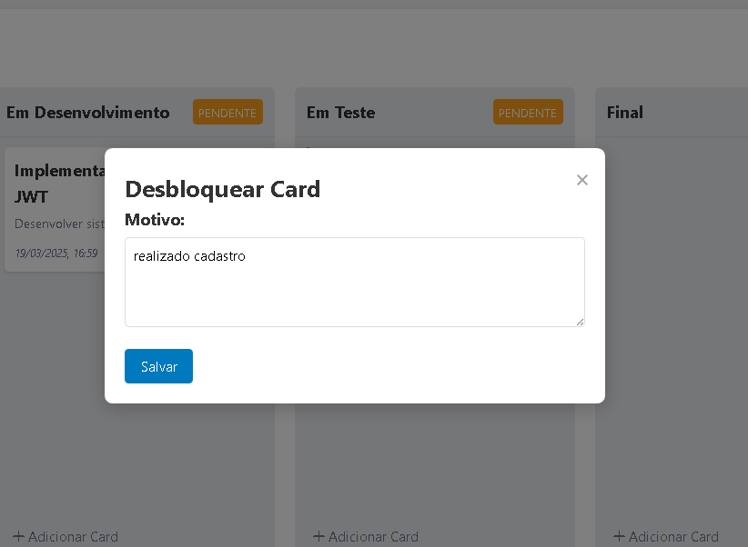
  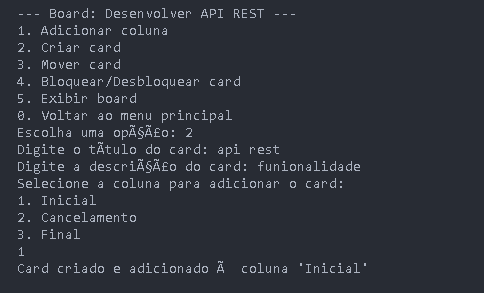
  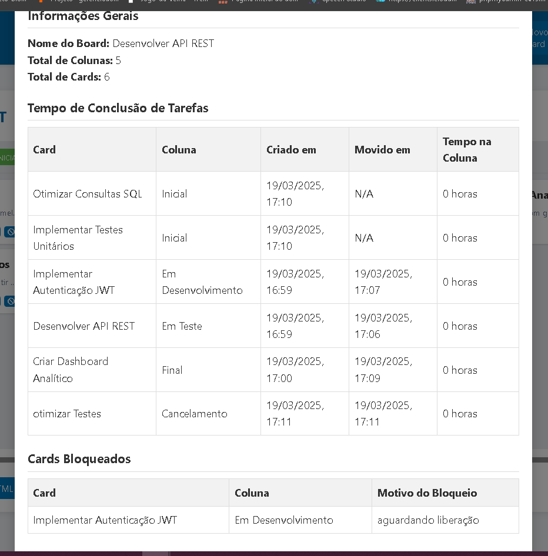
  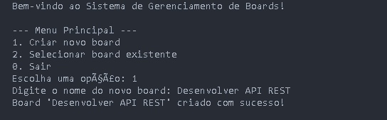
  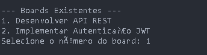
  
  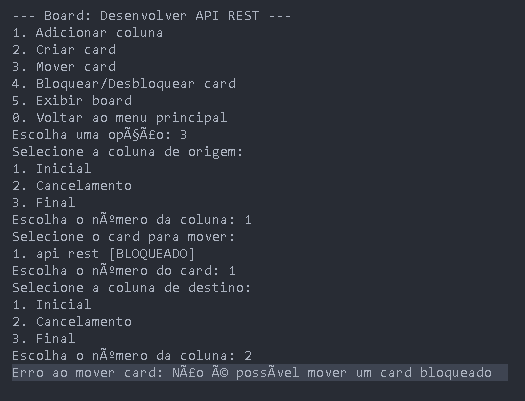
  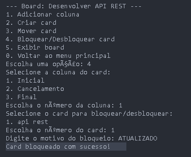

 

---
## 🚀 Tecnologias Utilizadas

Backend (Java)

Linguagem: 💻 Java 11  / - Persistência: 💾 JDBC  / -  Banco de Dados:  🔬 H2 (Desenvolvimento)  /  🗄️ MySQL (Produção)

Padrões: 📐 MVC, Repository

---
## Frontend (Web)

Linguagens: 🌐 HTML5, CSS3, JavaScript

Persistência: 🗃️ LocalStorage

Bibliotecas: 📚 FontAwesome

Recursos: 📊 Exportação HTML, Inspetor de Dados

---
## 🏗️ Estrutura Principal

Board: Representa um quadro Kanban com colunas

Coluna: Possui tipos (INICIAL, PENDENTE, FINAL, CANCELAMENTO)

Card: Contém título, descrição, data de criação, status de bloqueio

---
## 📋 Regras Implementadas

- Coluna INICIAL deve ser a primeira

- Coluna FINAL deve ser a penúltima

- Coluna CANCELAMENTO deve ser a última**

- Coluna PENDENTE pode ter quantas forem necessárias

- Cards só podem mover para a próxima coluna na ordem (exceto para CANCELAMENTO)

- Cards bloqueados não podem ser movidos até serem desbloqueados

- Bloquear/desbloquear card exige justificativa

## 🛠️ Desafios Encontrados

Implementação Java

Persistência de Dados: 💾

Configuração da conexão com banco de dados

Problemas com H2 vs MySQL

Implementação do padrão Repository

## Validações de Regras: 🧮

Lógica para validar movimentação entre colunas

Tratamento de cards bloqueados

Implementação das regras de ordenação

## Interface Web

Persistência Local: 🗃️

Implementação do armazenamento via localStorage  /  Sincronização entre sessões

## Visualização de Dados: 📊

Criação do Inspetor de Dados para debug  /  Limitações de trabalhar sem backend real

## Interface Gráfica: 🎨 

Implementação visual das regras de negócio  /  Garantia das mesmas validações da versão Java  /  Responsividade em diferentes dispositivos

---
## 📋 Funcionalidades do Sistema

- Menu principal com opções para criar/selecionar boards
- Criação manual de boards, colunas e cards
- Board de exemplo pré-configurado para demonstração
- Relatórios de tempo de conclusão de tarefas
- Relatórios de cards bloqueados
- Exportação para HTML (visualização)
- Persistência em banco de dados (Java) / localStorage (Web)

---
📊 Estado Atual
Implementamos todas as funcionalidades básicas e estamos trabalhando em melhorias para os relatórios e visualização. O sistema está funcionando e pronto para testes.

---

📝 Próximos Passos

1.  Testes finais do sistema com diferentes tipos de boards

    - Possíveis melhorias na interface de usuário

    - Refinamento dos relatórios

    - Implementação de uma API RESTful para integrar backend e frontend
  
---

👥 Agradeço sinceramente a oportunidade de compartilhar este projeto, que, embora simples, representa um marco significativo no meu aprendizado em desenvolvimento web. 
🌱 Reconheço que ainda tenho um longo caminho a percorrer e muito a aprender, mas estou comprometido em continuar me dedicando e aprimorando minhas habilidades.

🚀 Este projeto foi desenvolvido com a base de referência da Aula do Prof. Junior na DIO. 
( Criando seu Board de Tarefas com Java - Decola Tech 2025)

Feito por Jose Escudero (um dev em aprendizado!) 💻

"DEV APRENDIZADO" - Porque cada linha de código é um passo adiante! 🌈

